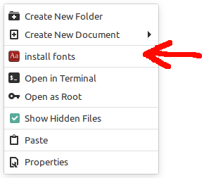

# linux-font-installer

Install all fonts in a directory with one command

for subtitle fonts and other usege

### installation

```
git clone https://github.com/mrmoein/linux-font-installer
cd linux-font-installer
pip3 install -r requirements.txt
sudo python3 setup.py
```

now you can run `font-installer` commend everywhere

go to directory that contain fonts and run `font-installer`

if you need help run `font-installer -h`

### right click install for linux mint

if you use nemo file manager, you can add a shortcut to it.

run: `font-installer --create-nemo-action`

nemo action screenshot:


